# Операционные системы UNIX/Linux (Базовый)

## Part 1. Установка ОС

1. Установить VirtualBox
2. Установить ВМ Ubuntu 20.04 Server LTS без графического интерфейса
3. Версия Ubuntu

    > `cat /etc/issue`

    

    _Версия Ubuntu_

## Part 2. Создание пользователя

1. Создать нового пользователя margaerg

    > `adduser margaerg` добавить пользователя 

    > `cat /etc/passw` проверка добавления пользователя 

    

    _Создание нового пользователя_

	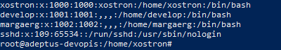

	_Проверка добавления пользователя_

2. Добавить пользователя margaerg в группу adm

    > `usermod -aG adm margaerg`

    > `groups margaerg` Проверка пользователь margaerg в группе adm

    

    _Добавление в группу adm_

## Part 3. Настройка сети ОС

1. Задай название машины вида user-1.

    > `hostnamectl` получить название машины 

    > `hostnamectl set-hostname user-1` установить новое имя машины 

    

    _Старое имя машины_

    

    _Новое имя машины_

2.  Установи временную зону, соответствующую твоему текущему местоположению.

    > `timedatectl set-timezone Europe/Volgograd`

    

    _Старое время_

    

    _Новое время_

3.  Выведи названия сетевых интерфейсов с помощью консольной команды. Что такое интерфейс lo.

    > `ip -br link show` или `ls /sys/class/net`

    

    _Сетевые интерфейсы_

    `-` lo (loopback) - виртуальный сетевой интерфейс, адрес по-умолчанию 127.0.0.1, используется для общения с самим собой по протоколу TCP/IP

    `-` enp0s3 - это имя сетевого интерфейса (сетевой карты ubuntu)

4.  Используя консольную команду, получи ip адрес устройства, на котором ты работаешь, от DHCP-сервера.

    > `ip addr show enp0s3`

    

    _ip адрес сетевой карты enp0s3_

    DHCP - Dynamic Host Configuration Protocol (Протокол динамической настройки узла). Роутер при обнаружении нового устройства, например, сетевая карта ноутбука, выдает ему ip адрес, свой внутренний ip адрес шлюз (gw), и адреса DNS серверов.

5.  Определи и выведи на экран внешний ip-адрес шлюза (ip) и внутренний IP-адрес шлюза, он же ip-адрес по умолчанию (gw).

    > `ip route` узнать внутренний ip шлюза default via = 10.0.2.2

    ')

    _Внутренний IP-адрес шлюза (gw) - default via_

    > `curl -4 icanhazip.com` узнать внешний ip шлюза 88.87.69.65

    

    _Внешний ip-адрес шлюза - провайдер_

6.  Задай статичные (заданные вручную, а не полученные от DHCP-сервера) настройки ip, gw, dns (используй публичный DNS-серверы, например 1.1.1.1 или 8.8.8.8).

    Для изменения настроек сети используется утилита Netplan, необходимо отредактировать конфигурационный файл, как на скрине ниже:

    > `nano /etc/netplan/*.yaml`

    

    _Содержимое конфигурационного файла \*.yaml_

7.  Перезагрузи виртуальную машину. Убедись, что статичные сетевые настройки (ip, gw, dns) соответствуют заданным в предыдущем пункте.

    > Выполнена перезагрузка `reboot`. Настройки сохранены!

8.  Успешно пропингуй удаленные хосты 1.1.1.1 и ya.ru и вставь в отчёт скрин с выводом команды. В выводе команды должна быть фраза «0% packet loss».

    > `ping -c 4 1.1.1.1 && ping -c 4 ya.ru`

    

    _ping 1.1.1.1 и ya.ru_

## Part 4. Обновление ОС

1. Обнови системные пакеты до последней на момент выполнения задания версии.

    > `apt update` - обновляет локальный индекс пакетов. Т.е. находит обновления всех доступных программ в репозиториях и сохраняет в индекс новый список версий. Без этой команды обновление системы пройдет в холостую со старым списком (индексом).

    > `apt list --upgradable` - Посмотреть список обновлений: Новая версия - [Текущая версия]

    > `apt upgrade -y` - Обновление программ. Берет новый индекс пакетов и сравнивает версии, которые необходимо обновить. (-y флаг "Да" разрешающий установку)

    

    _Система обновлена_

## Part 5. Использование команды sudo

1. Разреши пользователю, созданному в Part 2, выполнять команду sudo. (добавить в группу sudo)

    > `usermod -aG sudo margaerg`

    

    _Добавление пользователя в группу sudo_

2. Поменяй hostname ОС от имени пользователя, созданного в пункте Part 2 (используя sudo).

    > `su - margaerg` - переключиться на пользователя margaerg из Part2

    > `hostnamectl set-hostname adeptus-devopis` - изменить имя системы

     user-1 -> adeptus-devopis')
    

    _Изменение hostname (имя системы) user-1 -> adeptus-devopis_

    ```
    sudo (Substitute User DO) - контроллируемое делегирование полномочий.

    - Разделение прав: есть команды, которые выполняются только с правами root, и команды попроще.
    - Аудит и логирование: каждое действие через sudo записывается в системный лог (кто выполнил, когда, какую команду)
    - Безопасность пароля: у каждого пользователя свой пароль, и не нужно знать пароля суперпользователя.
    - Настройка прав и доступа для каждого пользователя
    ```

## Part 6. Установка и настройка службы времени

1.  Выведи время часового пояса, в котором ты сейчас находишься.
2.  Вывод следующей команды должен содержать NTPSynchronized=yes:

    `timedatectl show`

    

    _timedatectl текущее время_

    > `System clock synchronized: yes` и `NTP service: active` Служба уже настроена!

3.  Инструкция по включению службы автоматической синхронизации времени:

    -   `timedatectl set-ntp true` Включение службы

    -   `nano /etc/systemd/timesynccd.conf` в строке `NTP=` вписать серверы

    ```
    (текст)
    NTP=0.ru.pool.ntp.org 1.ru.pool.ntp.org pool.ntp.org
    FallbackNTP=ntp.ubuntu.com 8.8.8.8
    ```

    NTP - основные серверы. FallbackNTP - запасные, если основные недоступны.

    -   `systemctl restart systemd-timesyncd` Перезапуск для применения настроек

## Part 7. Установка и использование текстовых редакторов

1. Установи текстовые редакторы VIM (+ любые два по желанию NANO, MCEDIT, JOE и т. д.)

> Обновить идексный файл с ссылками на источники программы (обновлений): `apt update`
> Установка: `apt install joe`

2. Используя каждый из трех выбранных редакторов, создай файл test_X.txt, где X — название редактора, в котором создан файл. Напиши в нём свой никнейм, закрой файл с сохранением изменений.

    > Создать файлы `touch test_vim.txt && touch test_nano.txt && touch test_joe.txt`

    ### Vim

    > `vim test_vim.txt` открыть файл

    > `i` Переключиться на режим редактирования

    > Ввод margaerg, и Esc для перехода в режим команд

    > `:qw` Сохранить и закрыть редактор

    

    _Редактор Vim_

    ### Nano

    > `nano test_nano.txt` открыть файл

    > Ввод margaerg

    > `Ctrl + O` - комбинацией клавиш сохранить файл, `Enter` подвердить сохранение

    > `Ctrl + X` - закрыть редактор

    

    _Редактор Nano_

    ### Joe

    > `joe test_joe.txt` открыть файл

    > Ввод margaerg

    > `Ctrl + K`, затем `X` - cохранить и закрыть редактор

    

    _Редактор Joe_

3. Используя каждый из трех выбранных редакторов, открой файл на редактирование, отредактируй файл, заменив никнейм на строку «21 School 21», закрой файл без сохранения изменений.

    ### Vim

    > `:q!` выйти без сохранения

    

    _Редактор Vim_

    ### Nano

    > `Ctrl + X` - выйти без сохранения

    

    _Редактор Nano_

    ### Joe

    > `Ctrl + С` - выйти без сохранения

    

    _Редактор Joe_

4. Используя каждый из трех выбранных редакторов, отредактируй файл ещё раз (по аналогии с предыдущим пунктом), а затем освой функции поиска по содержимому файла (слово) и замены слова на любое другое.

    ### Vim

    > `Esc` включить режим команд

    > `:%s/[найти это]/[заменить на это]/g` поиск и замена
    >
    > - `%` Применить ко всему файлу, без данного знака применение будет на текущую строку
    > - `s` substitute комана заменить
    > - `g` замена всех вхождений, без данного символа, заменить только первое вхождение

    

    

    _Редактор Vim_

    ### Nano

    > `Ctrl + \` поиск и замена Replace
    
    > Введите слово, которое хотите заменить, и нажмите Enter
    
    > Введите новое слово и нажмите Enter, nano спросит, что делать с найденным совпадением:
    >
    > - `y` - заменить текущее
    > - `n` - пропустить и перейти к следующему
    > - `a` - заменить все совпадения сразу (all)
    > - `Ctrl + C` - отменить операцию.

    

    _Редактор Nano_

    ### Joe

    > Поиск слова: `Ctrl + K`, затем `F`. Введите текст и нажмите Enter
    
    > Выбрать опцию `R` (Replace) в появившемся меню.
    
    > Примечание: поиск начинается от курсора, поэтому лучше его поставить в начало строки

    
    
    
    

    _Редактор Joe_

## Part 8. Установка и базовая настройка сервиса SSHD
1. Установи службу SSHd.

	> `systemctl status ssh` проверка наличия и работы службы SSHd
	>
	> `apt update && apt install openssh-server -y` установить пакет SSHd *

	

	_Статус работы SSH (неактивен)_

	

	_Статус работы SSH (активен)_

2. Добавь автостарт службы при загрузке системы.

	> Алгоритм
	>> 1 `systemctl stop ssh.socket` выключить сокет, который держит порт 22 открытым
	>>
	>> 2 `systemctl disable ssh.socket` Убрать сокет из автозагрузки
	>>
	>> 3 `systemctl enable ssh.service` Добавить сервис в автозагрузку
	>>

	

	_SSH добавлен в автозагрузку_

	

	_Статус ssh.socket_

	

	_Статус ssh.service_

3. Перенастрой службу SSHd на порт 2022.

	> Шаг 1: Меняем порт в основном конфиге SSH
	>
	> `nano /etc/ssh/sshd_config`
	> 
	> Найти строку `Port 22` изменить на `Port 2022`, сохранить изменения

	

	_Меняем порт в основном конфиге SSH_

	> Шаг 2: Применяем изменения
	>
	> `systemctl daemon-reload` система перечитывает все конфиг файлы и обновляет свою внутреннюю карту служб
	>
	> `systemctl restart ssh.service` рестарт службы и сокета SSH

	')

	_Статус SSH после применения изменений (порт изменился на 2022)_

4. Используя команду ps, покажи наличие процесса sshd. Для этого к команде нужно подобрать ключи.
	
	> `ps aux | grep sshd` показать процесс sshd
	>
	> a (all) — показывает процессы всех пользователей
	>
	> u (user) — выводит таблицу с подробностями: имя пользователя, % CPU, % памяти.
	>
	> x — показывает процессы, у которых нет своего окна терминала (фоновые, как sshd).
	>
	

	_PID SSHD = 9823_

5. Перезагрузить и выполнить команду netstat -tan

	`netstat -tan`, аналог `ss -tlnp | grep 2022`
	
	### флаги -tan:
	> -t (tcp) — показывать только соединения по протоколу TCP (то, что нам нужно для SSH).
	> 
	> -a (all) — показывать и те порты, которые сейчас активно передают данные, и те, которые просто «слушают» (ждут подключения).
	> 
	> -n (numeric) — показывать адреса и порты цифрами, а не названиями.
	> 

	

	_netstat_

6. Для удаленного подключения по SSH, сделать проброс портов в virtualbox.

	

	_Проброс портов VirtualBox_

	### Значение каждого столбца вывода, значение 0.0.0.0.

	> `Proto` Протокол соединения. tcp или tcp6.
	> 
	> `Recv-Q` Очередь получения (Receive Queue). Количество байт, которые уже пришли в систему.
	> 
	> `Send-Q` Очередь отправки (Send Queue). Количество байт, которые твоя система отправила, но удаленный компьютер еще не подтвердил их получение.
	> 
	> `Local Address` IP-адрес твоего сервера и номер порта, который он использует.
	> 
	> `-` 0.0.0.0:2022 - ждет подключений на всех IPv4 адресах (может не иметь данной строки, но при наличии `tcp6 :::2022`, система принимает запросы tcp v4 и преобразует в tcp6)
	>
	> `-` :::2022 - ждет подключений на всех IPv6 адресах (Примечание, система  )
	> 
	> `-` 127.0.0.1:2022 - ждет только «изнутри» самой системы.
	> 
	> `Foreign Address` IP-адрес и порт удаленного компьютера, который подключился к тебе.
	> 
	> `-` 0.0.0.0:* — означает, что пока никто не подключен, сервер просто «слушает».
	> 
	> `State` Состояние соединения. Самое важное для админа:
	> 
	> `-` LISTEN — сервер ждет входящих подключений (твой случай с SSH).
	> 
	> `-` ESTABLISHED — сессия активна, кто-то прямо сейчас работает в системе.
	> 
	> `-` TIME_WAIT / CLOSE_WAIT — соединение в процессе закрытия.
	> 

## Part 9. Установка и использование утилит top, htop
1. Вывод команды `top`

	

	_top_

2. Вывод команды `htop`

	- `F6` Открыть меню для выбора колонок, по которому будет отсортирован список
	
	

	_htop сортировка PID_

	

	_htop сортировка PERCENT CPU_

	

	_htop сортировка PERCENT MEM_

	

	_htop сортировка TIME_

	- Показать процессы sshd (`F4` и ввести `sshd` - поиск процессов с sshd, чтобы сбросить фильтр нажать `F4` и удалить строку)

	

	_Поиск sshd_

   - Показать процессы syslog c добавленным выводом hostname, clock и uptime

	>
	> `F2` Setup - раздел `Meters` - используя клавиши стрелок и Enter добавить из колонки `Available meters` поля: `hostname`, `clock` и `uptime`   
	
	

	_hostname, clock и uptime_

## Part 10. Использование утилиты fdisk

> `fdisk -l` Показать информацию о диске
> 
> `swapon --show` или `free -h` показать информацию о swap (файл подкачки)
>


_Информация о диске_


_Файл подкачки swap=0Gb_


## Part 11. Использование утилиты df

1. Запусти команду df.

	

	- размер раздела: /dev/sda2 7374768
	- размер занятого пространства: 3364936
	- размер свободного пространства: 3364936
	- процент использования: 49%
	- Определи и напиши в отчёт единицу измерения в выводе: 7374768 Кб / 1024 = 7201 Мб / 1024 = 7.03 Гб

1. Запусти команду df -Th.

	

	- размер раздела: 7.1 Гб
	- размер занятого пространства: 3.3 Гб
	- размер свободного пространства: 3.5 Гб
	- процент использования: 49%
	- Определи и напиши в отчёт тип файловой системы для раздела: ext4

## Part 12. Использование утилиты du

> Размер папок /home, /var, /var/log в байтах


> Размер папок /home, /var, /var/log в человекочитаемом формате (Кб, Мб, Гб)

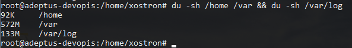

> Размер всего содержимого в /var/log (каждого вложенного элемента)

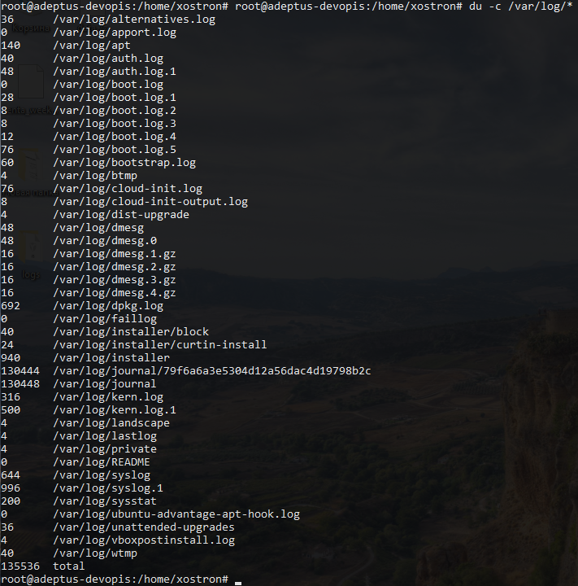

## Part 13. Установка и использование утилиты ncdu

> Размер папок /home, /var, /var/log 
> 
> `ncdu /`

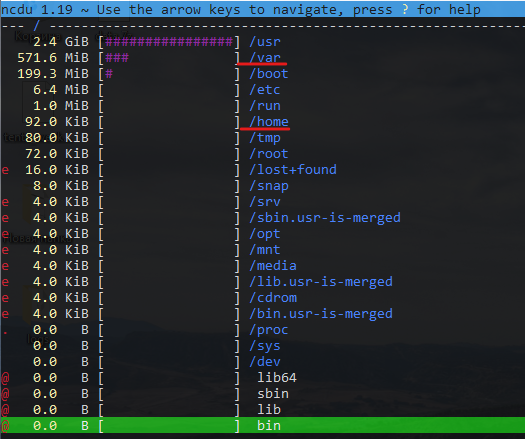


_слева - ncdu, справа - du_

## Part 14. Работа с системными журналами

1. Открыть /var/log/dmesg

	> `less /var/log/dmesg`

	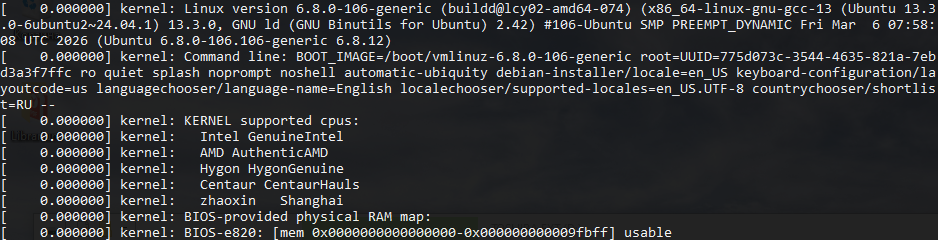

2. Открыть /var/log/syslog

	> `less /var/log/syslog`

	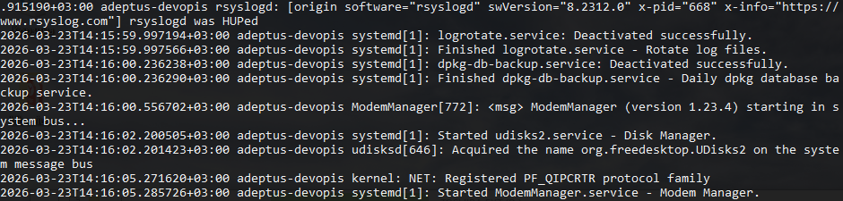

3. Открыть /var/log/auth.log

	> `less /var/log/auth.log`

	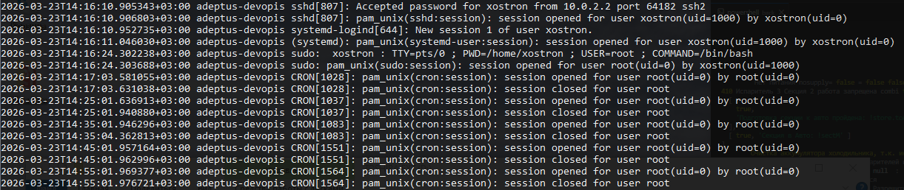

4. Время последней успешной авторизации, имя пользователя и метод входа в систему.

	> `grep "session opened" /var/log/auth.log | tail -n 1`

	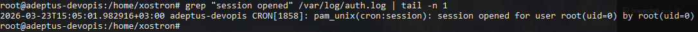

5. Перезапусти службу SSHd (скрин с сообщением о рестарте службы (искать в логах)).

	> `systemctl restart ssh` перезагрузка службы ssh
	>
	> `grep "sshd" /var/log/syslog | tail -n 20`
	>

	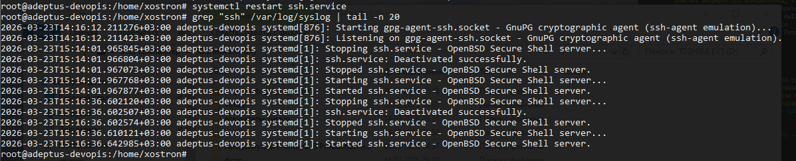


## Part 15. Использование планировщика заданий CRON

1. Используя планировщик заданий, запусти команду uptime через каждые 2 минуты.

	> `crontab -e` открыть редактор cron 

	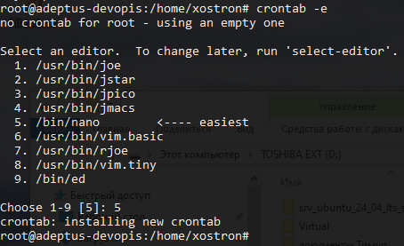

	> `*/2 * * * * uptime`

	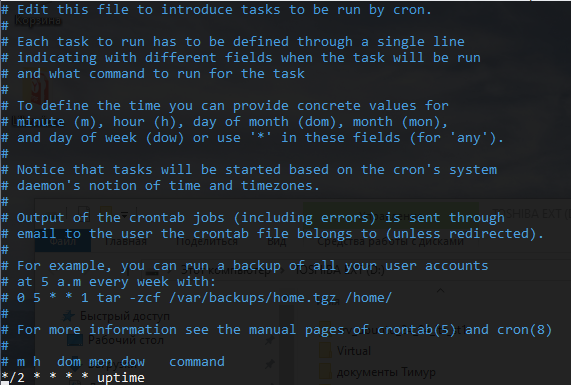

	> Найди в системных журналах строчки (минимум две в заданном временном диапазоне) о выполнении
	> 
	>`grep "uptime" /var/log/syslog | tail -n 20`

	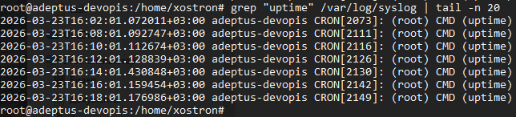

	> Выведи на экран список текущих заданий для CRON.
	>
	> `crontab -l`

	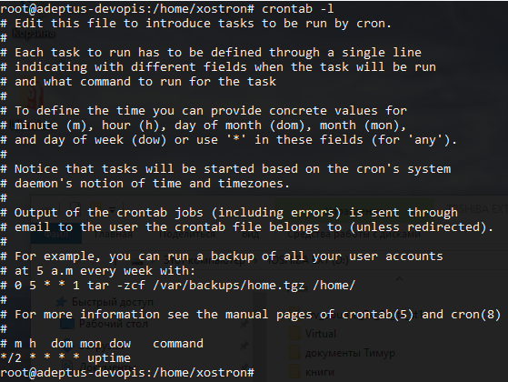

2. Удали все задания из планировщика заданий.

	> `crontab -r` Удалить все задачи из планировщика
	>
	> `crontab -l` Посмотреть все задачи планировщика

	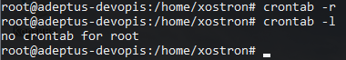