## 0. Подготовка к работе

1. Изменяем имя машины `hostnamectl set-hostname ws1`

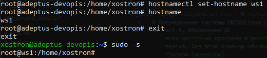

2. Снимки состояния виртуальной машины

- Создание снимка: `VirtualBox - Выделить машину - Справа выбрать раздел "Снимки" (snapshots) - Сделать снимок`

- Восстановление по снимку: `Выкл. машину - Справа выбрать раздел "Снимки" - Выбрать нужный и нажать "Восстановить"`
- Клонирование по снимку - создание независимой копии виртуальной машины на основе снимка. Полный клон - независимый, Связанный клон - требует наличия оригинала для работы.
    > При клонировании обязательно выбрaть галочку «Сгенерировать новые MAC-адреса для всех сетевых адаптеров», иначе в вашей сети будет два устройства с одинаковыми «паспортами»

3. Дампы (для перемещения виртуалки)

- Экспорт (создание дампа): `Выкл. машину - в заголовке "Файл" - Экспорт конфигураций (Export Appliance) - выбрать машину и сохранить файл в формате .ova`
- Импорт (восстановление дампа): `Файл - Импорт - выбрать файл .ova - Далее`
    > ИМПОРТ: В поле «Политика MAC-адресов» (MAC Address Policy) - «Сгенерировать новые MAC-адреса для всех сетевых адаптеров», если планируется запускать эту копию одновременно с оригиналом (чтобы не было конфликта в сети).

1. Переключение раскладки клавиатуры для Ubuntu Server

> Отредактировать файл `/etc/default/keyboard`:
> 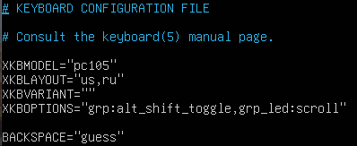
> Применить настройки `setupcon`

## Part 1. Инструмент ipcalc

1. Сети и маски

- Адрес сети 192.167.38.54/13

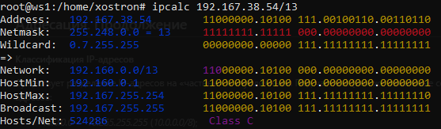

> Network 192.160.0.0/13 - это адрес сети 192.167.38.54/13, по аналогии это адрес дома, в котором находится квартира под номером 192.167.38.54/13

- Перевод маски 255.255.255.0 в префиксную и двоичную запись, /15 в обычную и двоичную, 11111111.11111111.11111111.11110000 в обычную и префиксную
    - Обычная 255.255.255.0: Префиксная /24, Двоичная 11111111.11111111.11111111. 00000000

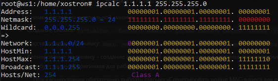

- Префиксная /15: Обычная 255.254.0.0, Двоичная 11111111.1111111 0.00000000.00000000

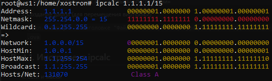

- Двоичная 11111111.11111111.11111111.11110000: Обычная /28, Префиксная 255.255.255.240
    > ipcalc не сработает с маской подсети в виде двоичного числа, поэтому нужно посчитать кол-во едениц, это и будет префиксный вид маски, также сама маска - это всегда непрерывная последовательность едениц слева

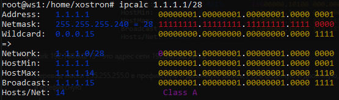

- Минимальный и максимальный хост в сети с различными масками:
    - 12.167.38.4/8: `HostMin 12.0.0.1, HostMax 12.255.255.254`
      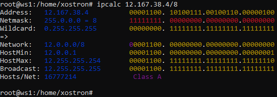

    - 12.167.38.4 11111111.11111111.00000000.00000000 = /16: `HostMin 12.167.0.1, HostMax 12.167.255.254`
      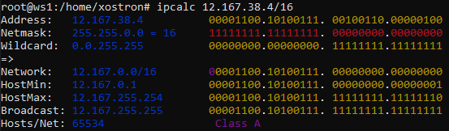

    - 12.167.38.4 255.255.254.0: `HostMin 12.167.38.1, HostMax 12.167.39.254`
      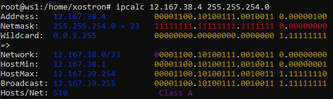

    - 12.167.38.4/4: `HostMin 0.0.0.1, HostMax 15.255.255.254`
      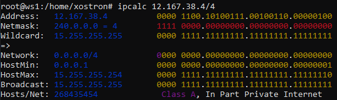

2. localhost

- Определи и запиши в отчёт, можно ли обратиться к приложению, работающему на localhost, со следующими IP: 194.34.23.100, 127.0.0.2, 127.1.0.1, 128.0.0.1

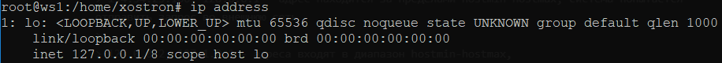

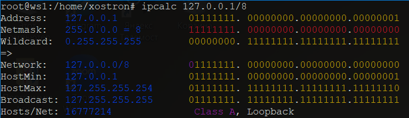

> localhost - это петлевой интерфейс, согласно стандартам под loopback зерезервирован весь диапазон сети 127.0.0.1/8, hostMin: 127.0.0.1, hostMax: 127.255.255.254. (см скрины выше).
>
> 194.34.23.100, 128.0.0.1 - адрес находится за пределами hostmin-hostmax, система попытается отправить запрос во внешнюю сеть
>
> 127.0.0.2, 127.1.0.1 - это localhost (адреса входят в диапазон hostmin-hostmax) и запрос отправится к приложению, если оно слушает весь localhost

1. Диапазоны и сегменты сетей

- Какие из перечисленных IP можно использовать в качестве публичного, а какие только в качестве частных: 10.0.0.45, 134.43.0.2, 192.168.4.2, 172.20.250.4, 172.0.2.1, 192.172.0.1, 172.68.0.2, 172.16.255.255, 10.10.10.10, 192.169.168.1

> Частные (серые) IP: Используются только внутри локальных сетей (дома, в офисе). Они не видны из интернета напрямую. Для них зарезервированы три строгих диапазона.
>
> Публичные (белые) IP: Уникальные адреса во всем интернете. Их выдает провайдер вашему роутеру, чтобы вы могли выходить в сеть.
>
> Зарезервированные диапазоны для частных сетей:
>
> 1. 10.0.0.0 — 10.255.255.255 (маска /8)
> 2. 172.16.0.0 — 172.31.255.255 (маска /12) — обрати внимание, только от 16 до 31!
> 3. 192.168.0.0 — 192.168.255.255 (маска /16)

### Примеры:

> Private: 10.0.0.45, 10.10.10.10, 192.168.4.2, 172.20.250.4, 172.16.255.255 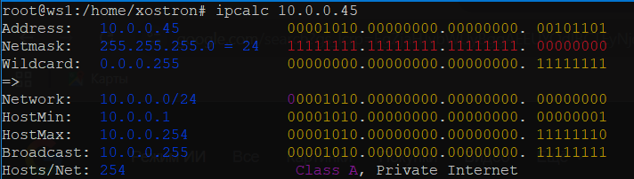
>
> Public: 134.43.0.2, 172.0.2.1, 192.172.0.1, 172.68.0.2, 192.169.168.1 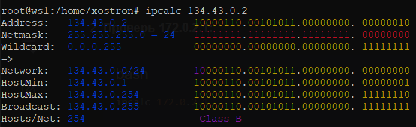

- Какие из перечисленных IP-адресов шлюза возможны у сети 10.10.0.0/18: 10.0.0.1, 10.10.0.2, 10.10.10.10, 10.10.100.1, 10.10.1.255

> Шлюз (Gateway) - это тот же хост, но имеющий соединение с двумя и более сетями, который может передавать информацию между сетями и направлять пакеты в другую сеть. Это «дверь» из локальной сети во внешний мир (обычно это IP-адрес твоего роутера) и это всегда один из хостов подсети hostmin-hostmax. То есть его адрес обязан быть в диапазоне от 10.10.0.1 до 10.10.63.254. Обычно шлюзу дают либо самый первый адрес в сети (.1), либо самый последний (.254), но чисто технически любой свободный адрес внутри диапазона может стать шлюзом.
>
> 10.0.0.1, 10.10.100.1 — Не входит в диапазон
>
> 10.10.0.2, 10.10.10.10, 10.10.1.255 — Да. Входит в диапазон. - эти адреса могут быть шлюзом

## Part 2. Статическая маршрутизация между двумя машинами

0.  Поднять вторую виртуальную машину и назвать ее ws2

- С помощью команды `ip a` посмотри существующие сетевые интерфейсы.

    > ws1 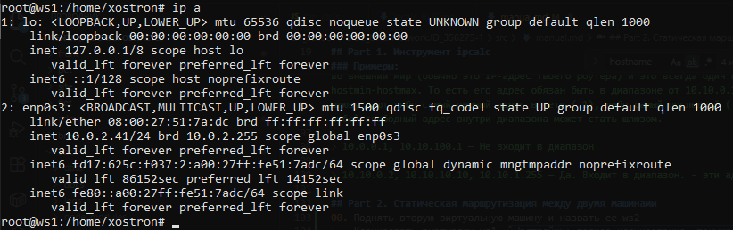
    > ws2 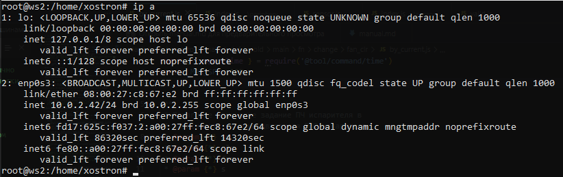
    >
    > - Клонировать виртуалку ws1. `Настройки: полное клонирование, текущее состояние машины, сгненрировать новые MAC-адреса`
    > - Переименовать машину на ws2: `hostnamectl set-hostname ws2`
    > - Изменить статический адрес машины: `nano /etc/netplan/*.yaml` -> см скрин ниже 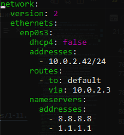
    > - Перезагрузить `Reboot` или `netplan apply`
    > - Настройка SSH
    >     > - Изменить порт на 2023: `nano /etc/ssh/sshd_config` -> Port 2023
    >     > - Принять изменения: `systemctl daemon-reload`
    >     > - Рестарт службы SSH: `systemctl restart ssh.service`

- Опиши сетевой интерфейс, соответствующий внутренней сети, на обеих машинах и задай следующие адреса и маски: ws1 — 192.168.100.10, маска /16, ws2 — 172.24.116.8, маска /12.

    > - netplan: изменить статические адреса при помощи `nano /etc/netplan/*.yaml`,
    >     > - ws1: 10.0.2.41/24 -> 192.168.100.10/16 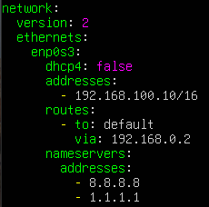
    >     > - ws2: 10.0.2.42/24 -> 172.24.116.8/12 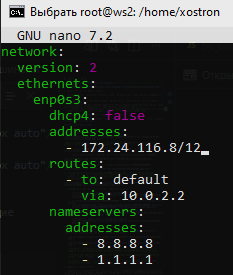

- Выполни команду netplan apply для перезапуска сервиса сети.

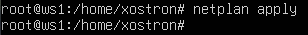
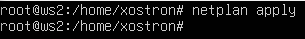

1. Добавление статического маршрута вручную
    > По умолчанию виртуальные машины в VirtualBox используют режим NAT, при котором они изолированы друг от друга: каждая находится в собственной приватной подсети и имеет выход во внешнюю сеть (Internet) через виртуальный шлюз. Чтобы обеспечить сетевую связность между машинами, их необходимо объединить в общую сеть NAT Network. Это создает единый сегмент виртуальной локальной сети (VLAN) с общим виртуальным маршрутизатором, позволяя узлам обмениваться пакетами напрямую и сохранять доступ к внешним сетям
    >
    > > 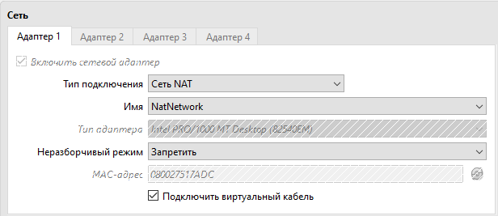
    > >  Также необходимо создать виртуальну сеть для NAT Network, см. скрин ниже
    > > 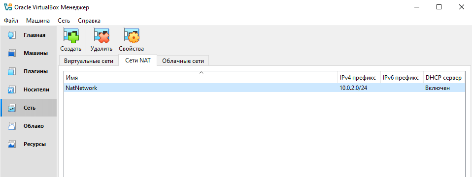

- Добавь статический маршрут от одной машины до другой и обратно при помощи команды вида ip r add. (Данный способ добавления маршрута после перезагрузки сбрасывается)
  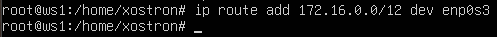

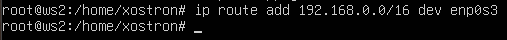

- Пропингуй соединение между машинами.

    > ws1
    > 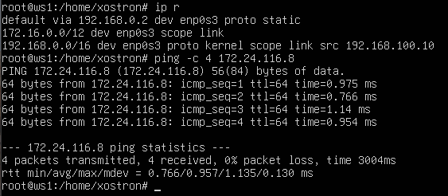

    > ws2
    > 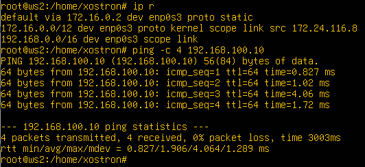

2. Добавление статического маршрута с сохранением

- Добавь статический маршрут от одной машины до другой с помощью файла /etc/netplan/00-installer-config.yaml. Пропингуй соединение между машинами.

    > ws1
    > 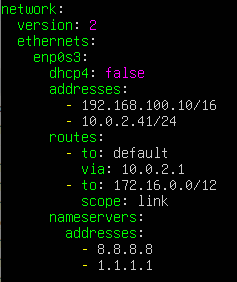
    > 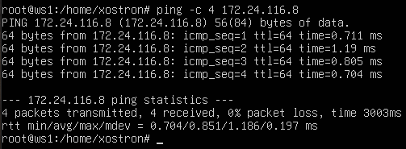

    > ws2
    > 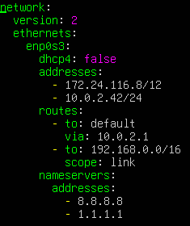
    > 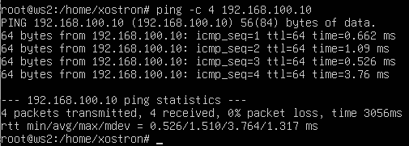

## Part 3. Утилита iperf3

1. Скорость соединения

- Переведи и запиши в отчёт: 8 Mbps в MB/s, 100 MB/s в Kbps, 1 Gbps в Mbps.

| Исходное            | Результат                             |
| ------------------- | ------------------------------------- |
| 8 Mbps (мегабит)    | 1 MB/s (мегабайт)                     |
| 100 MB/s (мегабайт) | 800000 Kbps (килобит) или 819200 Kbps |
| 1 Gbps (гигабит)    | 1000 Mbps (мегабит) или 1024 Mbps     |

2. Утилита iperf3

- Измерь скорость соединения между ws1 и ws2.
    > - Установить утилиту `apt update && apt install iperf3 -y`
    > - Для проверки скорости между ws1 и ws2 необходимо чтобы одна машина работала в роли сервера, а другая - в роли клиента
    >
    > > - Server ws1 [192.168.100.10]: `iperf3 -s`, ws1 будет слушать входящие соединения
    > >   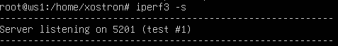
    > > - Client ws2 [172.24.116.8]: `iperf3 -c 192.168.100.10`, ws2 отправляет пакеты на ws1
    > >   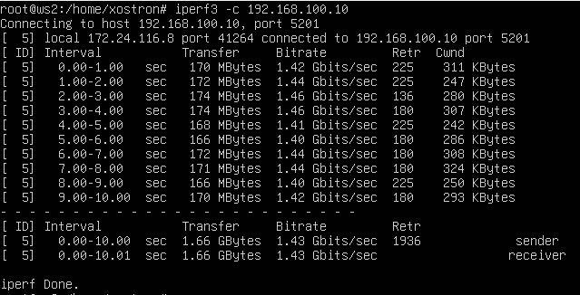
    > > - Расшифровка таблицы:
    > >     > - ID = 5 - номер потока
    > >     > - Interval - Время теста, по-умолчанию 10сек
    > >     > - Transfer - Объем данных переданных за время теста 1.66GBytes
    > >     > - Bitrate - Скорость передачи (реальная пропускная способность) 1.43Gbps
    > >     > - Retr (Retransmits) - Количество повторных отправок пакетов

## Part 4. Сетевой экран

### 4.1 Утилита iptables

- Создай файл /etc/firewall.sh, имитирующий файрвол, на ws1 и ws2:
  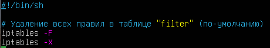

- Нужно добавить в файл подряд следующие правила:
-   1. На ws1 примени стратегию, когда в начале пишется запрещающее правило, а в конце пишется разрешающее правило (это касается пунктов 4 и 5).
-   2. На ws2 примени стратегию, когда в начале пишется разрешающее правило, а в конце пишется запрещающее правило (это касается пунктов 4 и 5).
-   3. Открой на машинах доступ для порта 22 (ssh) и порта 80 (http).
-   4. Запрети echo reply (машина не должна «пинговаться», т. е. должна быть блокировка на OUTPUT).
-   5. Разреши echo reply (машина должна «пинговаться»).
        > ws1 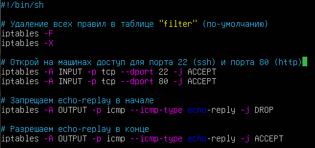
        > ws2 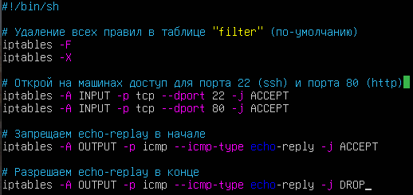
- Запусти файлы на обеих машинах командами chmod +x /etc/firewall.sh и /etc/firewall.sh.
  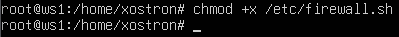
  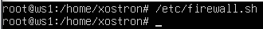
  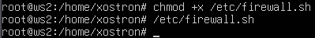
- В отчёте опиши разницу между стратегиями, применёнными в первом и втором файлах.

    > firewall.sh работает следующим образом:
    >
    > > 1 этап удаление правил, чтобы не было наложения правил.
    > > 2 этап открываем порты 22 и 80, если на машину по протоколу TCP на порт 20 или 80 приходит пакет, данный пакет примается ACCEPT и iptables его больше не трогает.
    > > 3 этап:
    > >
    > > > ws1 стартегия: сначала запрет echo-replay. Данная метка принадлежит протоколу ICMP. Такими пакетами сообщениями оперируют разные команды, одна из них ping.
    > > >
    > > > > ws1: Что происходит:
    > > > >
    > > > > > - ws2 пингует ws1, ws1 получает пакеты с меткой echo-request
    > > > > > - ws1 формирует ответ для ws2: пакет с меткой echo-replay
    > > > > > - Проверка: iptables проверяет пакет ws1 по цепочке из своего списка правил OUTPUT: их 2 для echo-replay.
    > > > > > - Результат: 1 правило ЗАПРЕТ для echo-replay (DROP). Подготовленный пакет для ws2 уничтожается. Итог ws2 не видит ответа от ws1.
    > > > > >   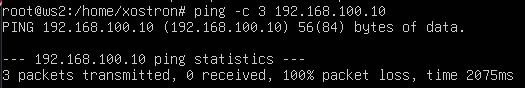

    > > > ws2 стратегия: сначала разрешение
    > > >
    > > > > ws2: Что происходит:
    > > > >
    > > > > > - ws1 пингует ws2, ws2 получает пакеты с меткой echo-request
    > > > > > - ws2 формирует ответ для ws1: пакет с меткой echo-replay
    > > > > > - Проверка: iptables проверяет пакет ws2 по цепочке из своего списка правил OUTPUT: их 2 для echo-replay.
    > > > > > - Результат: 1 правило РАЗРЕШИТЬ для echo-replay (ACCEPT). Подготовленный пакет отправляется на ws1. Итог ws1 получает ответы от ws2.
    > > > > >   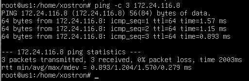

> Очистить правила файрвола `iptables -F && iptables -X`

### 4.2. Утилита nmap

- Командой ping найди машину, которая не «пингуется», после чего утилитой nmap покажи, что хост машины запущен.
    > `apt update && apt install nmap` установить namp
    > `nmap --version` проверить установку
    > ws2 не получает ответа от ws1 при ping, для проверки работает ли ws1, проверим его при помощи утилиты nmap
    >
    > > `nmap 192.168.100.10`
    > > 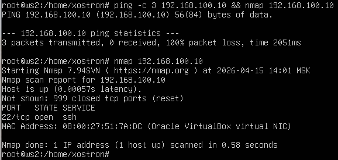
- Сохрани дампы образов виртуальных машин: `Выкл. машину - в заголовке "Файл" - Экспорт конфигураций (Export Appliance) - выбрать машину и сохранить файл в формате .ova`

## Part 5. Статическая маршрутизация сети

### 5.1. Настройка адресов машин

- Подними пять виртуальных машин (3 рабочие станции (ws11, ws21, ws22) и 2 роутера (r1, r2)). Настрой конфигурации машин в etc/netplan/00-installer-config.yaml согласно сети на рисунке.

| #   | Станция | Локальный IP1  | Локальный IP2  | Локальный IP (интернет) | IP Шлюза (интернет) |
| --- | ------- | -------------- | -------------- | ----------------------- | ------------------- |
| 1   | ws11    | 10.10.0.2/18   |                | 10.0.2.11/24            | 10.0.2.1            |
| 2   | ws21    | 10.20.0.10/26  |                | 10.0.2.21/24            | 10.0.2.1            |
| 3   | ws22    | 10.20.0.20./26 |                | 10.0.2.22/24            | 10.0.2.1            |
| 4   | r1      | 10.10.0.1/18   | 10.100.0.11/16 | 10.0.2.51/24            | 10.0.2.1            |
| 5   | r2      | 10.20.0.1/26   | 10.100.0.12.16 | 10.0.2.52/24            | 10.0.2.1            |

> ws11 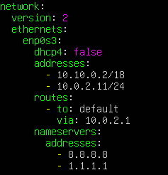
> ws21 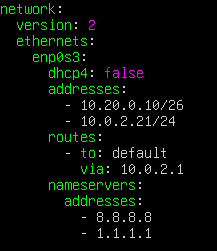
> ws22 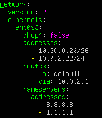
> r1 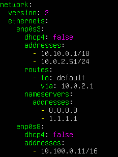
> r2 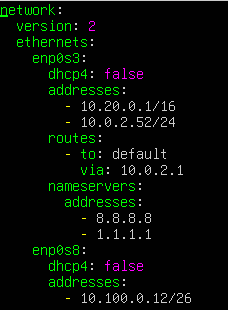

- Перезапусти сервис сети. Если ошибок нет, командой `ip -4 a` проверь, что адрес машины задан верно. Также пропингуй ws22 с ws21. Аналогично пропингуй r1 с ws11.

    > `ip -4 a`
    > ws11 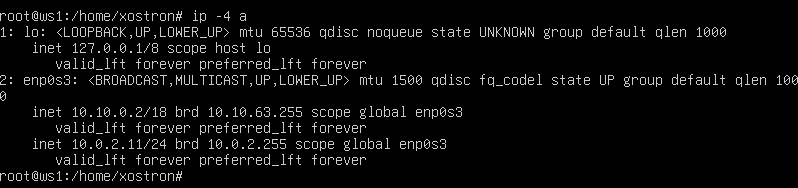
    > ws21 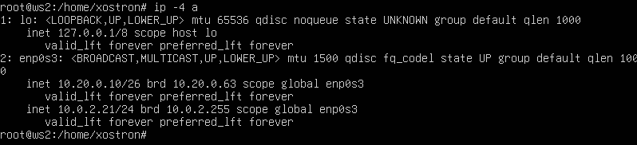
    > ws22 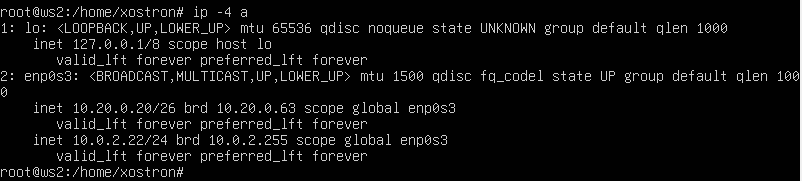
    > r1 
    > r2 

    > `ping -c 4 10.20.0.20` пропинговать ws22 с ws21
    >  ws22" title="ws21 -> ws22" style="display:block;margin:16px auto"/>
    > `ping -c 4 10.10.0.1` пропинговать r1 с ws11
    >  r1" title="ws11 -> r1" style="display:block;margin:16px auto"/>

### 5.2. Включение переадресации IP-адресов

- Для включения переадресации IP выполни команду на роутерах: `sysctl -w net.ipv4.ip_forward=1`. При таком подходе переадресация не будет работать после перезагрузки системы.
    > r1 
    > r2 
- Открой файл /etc/sysctl.conf и добавь в него следующую строку: `net.ipv4.ip_forward = 1` При использовании этого подхода, IP-переадресация включена на постоянной основе.
  

### 5.3. Установка маршрута по умолчанию

> Когда ws11, ws21, ws22 будут обращаться во внешний мир, маршрут по-умолчанию будет их направлять через роутер r1 для ws11, r2 для ws21|22

- Настрой маршрут по умолчанию (шлюз) для рабочих станций. Для этого добавь default перед IP-роутера в файле конфигураций.
    > ws11 
    > ws21 
    > ws22 
- Вызови `ip r` и покажи, что добавился маршрут в таблицу маршрутизации.
    > ws11 
    > ws21 
    > ws22 
- Пропингуй с ws11 роутер r2 и покажи на r2, что пинг доходит. Для этого используй команду на r2: `tcpdump -tn -i enp0s8`
    > r2 получает пакеты от ws11, но r2 пока еще не настроен чтобы ответить ws1, так как он не знает куда отвечать.
    > ws11 
    > r2 

### 5.4. Добавление статических маршрутов

> В пункте 5.3, когда ws11 ping r2, r2 не знает кому отвечать, т.к. ws11 в другой подсети, к которой подключен r1. Чтобы r2 понимал кому отвечать, добавим статические маршруты:
>
> - `-to: 10.10.0.0/18` идентификатор для r2 - существует такая подсеть
> - `via:10.100.0.11` для подсети `10.10.0.0/18` r2 будет отправлять пакеты на `via:10.100.0.11 (r1)`

- Добавь в роутеры r1 и r2 статические маршруты в файле конфигураций.
    > r1 
    > r2 
- Вызови `ip r` и покажи таблицы с маршрутами на обоих роутерах.
    > r1 
    > r2 
- Запусти команды на ws11: `ip r list 10.10.0.0/18` и `ip r list 0.0.0.0/0`
    > `ip r list 10.10.0.0/18 && ip r list 0.0.0.0/0` 
    > В отчёте объясни, почему для адреса 10.10.0.0/[маска сети] был выбран маршрут, отличный от 0.0.0.0/0, хотя он попадает под маршрут по умолчанию.
    >
    > > - При вызове команды `ip r list 10.10.0.0/18`, система понимает, что адрес [10.10.0.0/18] находится в той же подсети, что и наша машина с адресом [10.10.0.2/18]. Поэтому пакеты будут отправляться из порта enp0s3 c подписью что это от [10.10.0.2], для того чтобы получить ответ.
    > > - При вызове команды `ip r list 0.0.0.0/0`, система понимает что этот адрес не входит в нашу подсеть, поэтому для него выбирается маршрут отправки по-умолчанию 10.10.0.1 (наш роутер r1)

### 5.5. Построение списка маршрутизаторов

- Запусти на r1 команду дампа: `tcpdump -tnv -i eth0` 
- При помощи утилиты traceroute построй список маршрутизаторов на пути от ws11 до ws21. `traceroute 10.20.0.10` 
    > traceroute основан на поле TTL (Time To Live) в IP-пакете.
    >
    > - TTL — это «срок жизни» пакета, равный количеству прыжков (хопов) через роутеры. Каждый роутер, пропуская пакет через себя, уменьшает TTL на 1. Если TTL становится равен 0, роутер уничтожает пакет и отправляет отправителю ответ: ICMP Time Exceeded.
    >   Этапы:
    >
    > 1. ws11 отправляет пакет к ws21 с TTL=1
    >     > - Пакет доходит до r1. r1 вычитает 1, получает 0, убивает пакет и отвечает ws11: «Время истекло». Так ws11 узнает адрес первого роутера.
    > 2. ws11 отправляет пакет с TTL=2
    >     > - r1 вычитает 1 (TTL теперь 1) и пробрасывает пакет на r2. r2 вычитает 1, получает 0 и отвечает: «Время истекло». Так ws11 узнает адрес второго роутера.
    > 3. ws11 отправляет пакет с TTL=3
    >     > - r1 вычитает 1 (TTL=2), оптравляет к r2, r2 вычитает 1 (TTL=2) отправляет к ws21, (Цель) ws21, понимает что пакет его, вычитает 1, открывает пакет и читает его (traceroute отправляет пакеты на высокий порт, например 33434, на ws21 никто не слушает этот порт), поэтому и отвечает «Порт закрыт» («ICMP Destination Unreachable (Port Unreachable)»). Так ws11 узнает адрес ws21.
    > 4. TTL 4, 5, 6...: Утилита traceroute по инерции успевает выплюнуть еще несколько пачек пакетов с бОльшим запасом жизни, прежде чем осознает, что цель уже ответила и пора останавливаться.
    >    Итог:
    >     > Роутеры говорят: Время истекло и уничтожают пакет.
    >     > Конечная цель говорит: «Я жива, пакет получила, но такой порт у меня закрыт».

### 5.6. Использование протокола ICMP при маршрутизации

- Запусти на r1 перехват сетевого трафика, проходящего через eth0 с помощью команды: `tcpdump -n -i eth0 icmp` 
- Пропингуй с ws11 несуществующий IP (например, 10.30.0.111) с помощью команды: `ping -c 1 10.30.0.111` 
    > Итог:
    >
    > > 1. Запрос от ws11 на 10.30.0.111, так как этот адрес не принадлежит подсети 10.10.0.х/18, то пакет отправляется по-умолчанию default 10.10.0.1 на r1
    > > 2. Роутер r1 получает пакет и сверяет со своей таблицей маршрутизации, понимаем что пакет адресован не ему, и выдает ICMP Redirect, предлагая использовать другой шлюз (10.0.2.1) для этой цели. ICMP Redirect — это механизм оптимизации пути. В данной ситуации это ложная оптимизация, так как шлюз 10.0.2.1 физически недоступен для ws11 напрямую. Пакеты так и будут ходить через r1, а r1 будет продолжать слать редиректами в пустоту. (Redirect на r1 можно отключить)
    > > 3. r1 пересылает пакет дальше (TTL падает на 1), но ответа нет, так как хост не отвечает.

## Part 6. Динамическая настройка IP с помощью DHCP

- Для r2 настрой в файле /etc/dhcp/dhcpd.conf конфигурацию службы DHCP: - Установить `apt update && sudo apt install isc-dhcp-server -y` службу DHCP
    - Укажи адрес маршрутизатора по умолчанию, DNS-сервер и адрес внутренней сети `nano /etc/dhcp/dhcpd.conf`. 
    - В файле /etc/resolv.conf пропиши nameserver 8.8.8.8.  - VirtualBox для машин изменил сети NAT (без этого ws21 не получал IP от r2) 
          <!--  -->
    - Перезагрузи службу DHCP командой `systemctl restart isc-dhcp-server`.  - Статус запуска DHCP сервера `systemctl status isc-dhcp-server` 
          <!--  -->
- Машину ws21 перезагрузи при помощи `reboot` и через `ip a` покажи, что она получила адрес. Также пропингуй ws22 с ws21.
    - ws21 до перезагрузки 
    - Включить динамический IP `nano /etc/netplan/*.yaml` 
    - ws21 после перезагрузки 
    - ws22 ping 
        <!--  -->
- Укажи MAC-адрес у ws11, для этого в etc/netplan/00-installer-config.yaml надо добавить строки: macaddress: 10:10:10:10:10:BA, dhcp4: true.
    - `ip link show enp0s3` узнать МАС-адрес ws11. 
    - `nano etc/netplan/00-installer-config.yaml` добавить настройки МАС в конфигурацию netplan 
        <!--  -->
- Для r1 настрой аналогично r2, но сделай выдачу адресов с жесткой привязкой к MAC-адресу (ws11). Проведи аналогичные тесты.
    - Внести изменения в `nano /etc/dhcp/dhcpd.conf`. 
    - Перезагрузи службу DHCP командой `systemctl restart isc-dhcp-server`. 
    - Статус dhcp r1. 

- Тесты ws11 - r1:
    - ws11: Установить: `apt update && apt install isc-dhcp-client`
    - ws11: Перезагрузить и посмотреть выданный IP: `ip a` после перезагрузки 
    - ws11: Запросить новый IP у r1:
        -   1.  Сообщаем DHCP-серверу, что текущий адрес больше не используется. `dhclient -r`. 
        -   2. Запрос нового IP у DHCP-сервера. `dhclient -v` 
        -   3. `ip a` после запроса нового IP. 
             <!--  -->

- Запроси с ws21 обновление IP-адреса.
    - Установить: `apt update && apt install isc-dhcp-client`
    - `ip a` до обновления 
    - Запросить новый IP у r2:
        -   1. Сообщаем DHCP-серверу, что текущий адрес больше не используется. `dhclient -r`
        -   2. Запрос нового IP у DHCP-сервера. `dhclient -v` 
    - `ip a` после запроса нового IP. 

## Part 7. NAT

## Part 8. Дополнительно. Знакомство с SSH Tunnels
